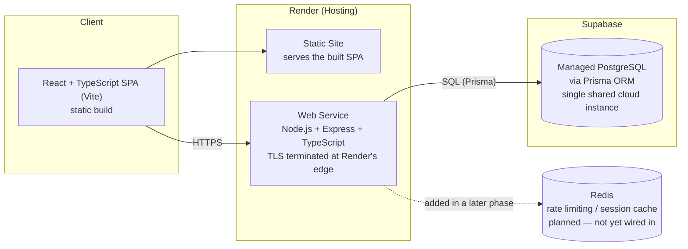
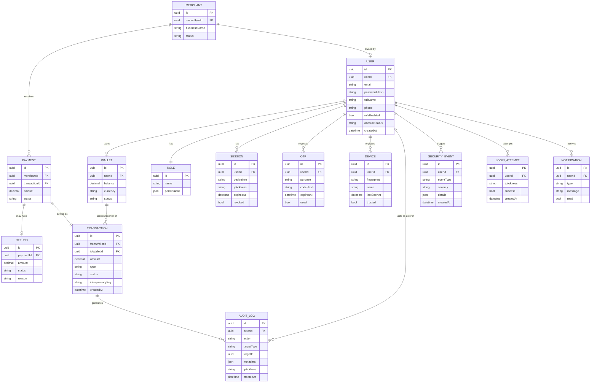
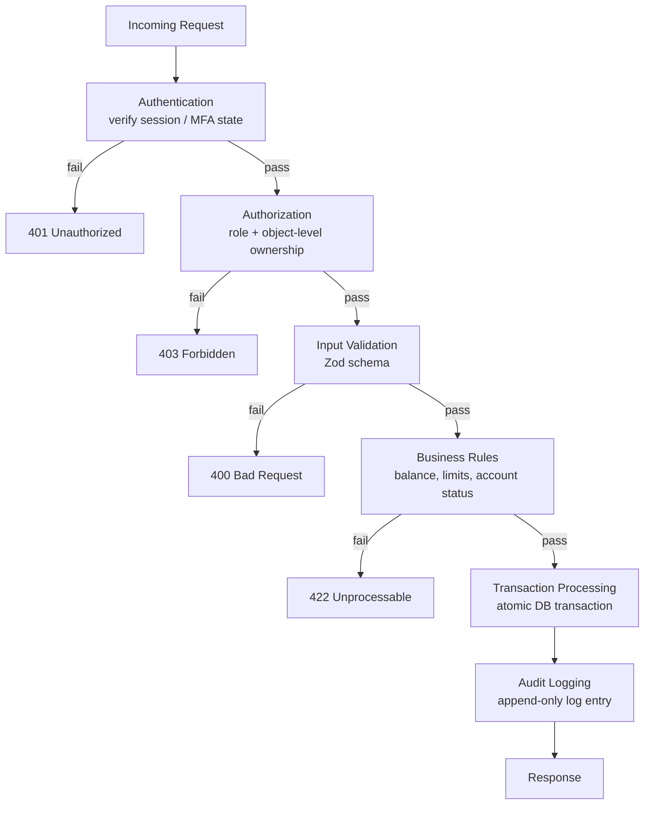

# SecurePay — Secure Digital Wallet & Payment Simulation

SecurePay is a virtual-money digital payment platform where users register, hold a
wallet, transfer virtual money, pay merchants, receive refunds, and manage their
accounts. **No real money is involved** — every balance and transaction is
simulated — but the system is designed and built using production-style security
engineering practices. Security is treated as a first-class feature of the
product, not an afterthought bolted on at the end.

SecurePay runs as a **single, publicly hosted instance backed by a single cloud
database**, shared by everyone who uses it. See
[§2 Deployment Model & Security Testing Policy](#2-deployment-model--security-testing-policy)
for what that means in practice — in short, using the app normally and
attempting to break it are **both** explicitly in scope.

> Status: living design document. Phases 1–6 are functionally complete; the
> one open item across all of them is pointing the app at a real Supabase
> project instead of a local Postgres instance — see
> [§16 Development Roadmap](#16-development-roadmap) for exact status.

---

## Table of Contents

1. [Application Scope](#1-application-scope)
2. [Deployment Model & Security Testing Policy](#2-deployment-model--security-testing-policy)
3. [User Roles](#3-user-roles)
4. [Application Architecture](#4-application-architecture)
5. [Database Architecture](#5-database-architecture)
6. [API Structure](#6-api-structure)
7. [Assets We Protect](#7-assets-we-protect)
8. [Attack Surface](#8-attack-surface)
9. [Threat Model](#9-threat-model)
10. [Attacks We're Considering & Mitigations](#10-attacks-were-considering--mitigations)
11. [OWASP Top 10 Mapping](#11-owasp-top-10-mapping)
12. [Security Requirements](#12-security-requirements)
13. [Security Controls — Request Pipeline](#13-security-controls--request-pipeline)
14. [Technology Stack](#14-technology-stack)
15. [Repository Structure](#15-repository-structure)
16. [Development Roadmap](#16-development-roadmap)

---

## Running SecurePay locally

### Prerequisites

- Node.js 20 or later and npm.
- A running PostgreSQL 16+ database (local Docker/Postgres or a Supabase
  project). Redis is **not required** for the current in-memory demo limiter.

### 1. Configure environment files

The repository provides safe templates; do not commit the generated local files.

```bash
cp backend/.env.example backend/.env
cp frontend/.env.example frontend/.env.local
```

Set `DATABASE_URL` in `backend/.env` to your PostgreSQL connection string and
replace `COOKIE_SECRET` with a value from `openssl rand -hex 32`. Keep the local
defaults of `CORS_ORIGIN=http://localhost:5173` and
`VITE_API_BASE_URL=http://localhost:4000/api` when running both services locally.

### 2. Install and prepare the backend

```bash
cd backend
npm install
npx prisma generate
npx prisma migrate deploy
npm run prisma:seed
npm run dev
```

The API listens on `http://localhost:4000`; verify it with
`curl http://localhost:4000/api/health`.

### 3. Start the frontend in a second terminal

```bash
cd frontend
npm install
npm run dev
```

### Verification commands

```bash
cd backend && npm test && npm run typecheck && npm run build
cd frontend && npm run lint && npm run build
```

---

## 1. Application Scope

SecurePay simulates a digital wallet / payment platform. In scope:

- Account registration, login, and identity verification for individual users.
- A per-user virtual wallet with a simulated balance (e.g. new users start with
  ₹10,000 virtual currency).
- Peer-to-peer transfers between users (send / receive money).
- Merchant accounts that can accept payments and generate payment requests.
- Refunds initiated by merchants (or requested by users) against prior payments.
- Full transaction history for users and merchants.
- Session and device management (view/revoke active sessions).
- Security settings for users (password change, MFA enrollment).
- An admin console for user/merchant management, transaction monitoring,
  freezing/unfreezing accounts, fraud & security alerts, and audit log review.

Out of scope (explicitly, for this simulation):

- Any real monetary movement, real banking/card integration, or real payment
  gateway integration.
- Real email/SMS delivery — verification and notification flows are simulated
  (e.g. an OTP is written to the database and surfaced in-app/in logs, never
  actually emailed or texted).
- Real KYC with government identity providers.
- Multi-currency / FX handling.
- Public API access for third-party integrators (v1 is first-party web only).

## 2. Deployment Model & Security Testing Policy

This is the piece that shapes almost every other decision in this document, so
it gets called out on its own rather than buried in the architecture section.

**Topology.** There is exactly one publicly hosted SecurePay deployment (on
Render) and exactly one cloud database (a Supabase PostgreSQL project).
Everyone — casual users and security testers alike — uses the same seeded/demo
environment. There are no per-tester sandboxes, no real users, no real money,
no real emails or SMS, and no real payment gateways: every account, balance,
and transaction is simulated data that is safe to create, break, or reset.

**Dual-use, by design.** Two categories of traffic are both explicitly
permitted against this one shared instance:

1. **Normal use** — registering, sending money, paying a merchant, requesting
   a refund, and everything else in [§1](#1-application-scope).
2. **Authorized security testing** — SQL injection attempts, brute-forcing
   login, probing for IDOR, tampering with request parameters, replaying
   requests, racing concurrent transfers, and the rest of
   [§10](#10-attacks-were-considering--mitigations).

Because both are expected traffic on the same instance, the application must
**never** treat "this looks like an attack" as a reason to behave differently
at the transport level (dropping the connection, hanging, crashing). Every
request — benign or malicious — goes through the same
[request pipeline](#13-security-controls--request-pipeline): it is either
processed correctly or rejected with a correct, meaningful HTTP status, and
either way a log entry is written. This has concrete engineering
consequences, formalized as security requirements in [§12](#12-security-requirements):

- Failed logins, rejected IDOR attempts, tampered parameters, and other
  suspicious activity must produce a **visible `SecurityEvent`/`AuditLog`
  entry**, reviewable on the admin security dashboard — not just a 4xx
  response and silence.
- Defensive throttles (rate limiting, lockouts) are real controls — and are
  themselves part of what testers are probing — but they **recover
  automatically on a timer**. Nothing here requires an admin to manually
  unblock a tester, since many different people share the same demo accounts
  and IP ranges over time.
- No field in this system holds real PII, so there is nothing to protect from
  *disclosure* in the traditional sense — but the system still defends against
  information disclosure *as an attack class*, because "did the access
  control actually work" is exactly what a tester is there to check.

## 3. User Roles

| Role | Summary | Key capabilities |
|---|---|---|
| 👤 **User** | Individual wallet holder | Register/login, verify account, hold a wallet, send/receive money, pay merchants, view transaction history, request refunds, manage profile, manage sessions/devices, manage security settings (password, MFA) |
| 🏪 **Merchant** | Business account that accepts payments | Merchant registration, merchant dashboard, receive payments, generate payment requests, view transaction history, manage/issue refunds |
| 🛡️ **Admin** | Platform operator | User management, merchant management, transaction monitoring, freeze/unfreeze accounts, view fraud/security alerts, review audit logs, security dashboard |

Roles are modeled as a first-class `Role` entity (see
[§5](#5-database-architecture)) rather than a boolean flag, so authorization
checks are explicit and role capabilities can evolve (e.g. adding a
support-agent role later) without a schema migration touching every table.

## 4. Application Architecture



**Layer responsibilities**

- **Frontend (React + TS + Vite)** — deployed as a static build on Render;
  renders UI and never holds authoritative state (balances, permissions) — all
  sensitive logic is re-verified server-side.
- **Backend (Express + TS, Render web service)** — owns the security pipeline
  in [§13](#13-security-controls--request-pipeline), all business logic, and
  all data access. Render terminates TLS at its edge and forwards plain HTTP
  to the service, which is why `app.set("trust proxy", 1)` is required for
  correct client IPs (rate limiting, audit logs) and secure-cookie detection —
  there is no separate self-managed reverse proxy in front of it.
- **PostgreSQL (Supabase, via Prisma)** — system of record; a single shared
  cloud instance, relational integrity via foreign keys, unique constraints,
  and transactions. See [§5](#5-database-architecture) for connection details.
- **Redis** — planned for rate limiting and short-lived OTP/MFA challenge
  state once that phase of work begins; not part of the codebase yet, so it is
  shown dashed above.

This supersedes the originally planned AWS + self-managed Nginx deployment:
Render's managed platform already provides TLS termination and reverse
proxying, so that layer is no longer part of the architecture.

## 5. Database Architecture

A single Supabase-managed PostgreSQL instance is the system of record for the
whole public deployment — every user, merchant, and admin account (all demo
data) lives in the same database. That's intentional: cross-account scenarios
(user A pays merchant B, admin C freezes user A) need to see each other's
data, and there's no real data to isolate.



Design notes carried into every table:

- Primary keys are UUIDs, never sequential integers.
- Every foreign key has a database-level constraint (no orphaned rows).
- Financial fields use `Decimal`, never floating point.
- `email` (User) and `businessName`/`ownerUserId` (Merchant) are unique.
- Multi-row financial mutations (a transfer touching two wallets) run inside a
  single Prisma `$transaction`.
- Indexes on all foreign keys and on frequently filtered columns (`userId`,
  `status`, `createdAt`).
- Passwords are never stored — only `passwordHash` (Argon2id). OTP codes and
  session tokens are stored hashed, not in plaintext.

**Connecting to Supabase.** The backend is a persistent Express process on
Render, not a serverless function, so it uses Supabase's **direct** (or
session-mode pooled) connection string for both the running app and for
`prisma migrate`/`prisma studio` — there's no need for the transaction-mode
pgbouncer pooler that serverless deployments require, which keeps the
connection configuration to a single `DATABASE_URL` (see
`backend/.env.example`). Migrations are version-controlled under
`backend/prisma/migrations/` and applied with `prisma migrate deploy` against
the shared Supabase database.

## 6. API Structure

- Every route is namespaced under `/api` (e.g. `/api/auth/login`,
  `/api/wallet`, `/api/transactions`, `/api/merchants/:id/payments`,
  `/api/admin/users`).
- Resources are named as plural nouns; actions that don't map to a CRUD verb
  are modeled as a sub-resource (`POST /api/transactions/:id/refund`, not a
  verb in the path).
- Unversioned for now (`/api/...`); a breaking change would introduce
  `/api/v2` rather than break existing clients silently.
- Every response is JSON. Errors follow one shape, produced by the centralized
  error handler: `{ "error": string, "details"?: object }` — never a raw stack
  trace or driver error.
- Authentication is via an HttpOnly session cookie sent automatically by the
  browser (`credentials: "include"`) — no bearer tokens in headers, no tokens
  in the JSON body, ever.
- Financial mutation endpoints accept a client-generated idempotency key
  (mapped to `Transaction.idempotencyKey`) so a retried request is safe to
  resubmit instead of double-processing.
- List endpoints accept `?page=` / `?pageSize=` with a server-enforced maximum
  page size — both for usability and so a client can't force an unbounded
  table scan.

## 7. Assets We Protect

| Asset | Why it matters |
|---|---|
| User accounts | Identity anchor for every action; compromise = full account takeover |
| Passwords | Must never be recoverable, even by us — hashed, not encrypted |
| Sessions | Bearer of authenticated identity after login; theft = account takeover without a password |
| Wallet balances | The "money" in the system; integrity of balance is the core product guarantee |
| Transactions | Financial record of truth; must be accurate, immutable, and non-repudiable |
| Personal information | Name, email, phone — all demo data, but access-control correctness around it is still what's being tested |
| Merchant information | Business identity, payout details, dashboards — fraud target |
| Audit logs | Forensic record; must be tamper-evident and reviewable, or the rest of the security model is unverifiable |
| Authentication tokens | Session/refresh/MFA tokens; theft bypasses login entirely |
| Security keys | Signing/encryption keys (session signing, MFA secrets); root of trust for everything else |

## 8. Attack Surface

Every point where untrusted input or an untrusted actor touches the system:

- **Public web frontend** — React SPA served over HTTPS; browser is fully
  untrusted (dev tools, extensions, tampered requests).
- **REST API (backend)** — every endpoint is a potential entry point: auth
  endpoints, wallet/transfer endpoints, merchant payment endpoints, admin
  endpoints.
- **Authentication flows** — login, registration, password reset, MFA
  challenge/response, OTP verification.
- **Session/cookie handling** — HttpOnly cookies, CSRF tokens, session
  fixation/rotation points.
- **Financial mutation endpoints** — send money, pay merchant, refund —
  anywhere balance changes.
- **Admin console** — highest-privilege surface; a single compromised admin
  session affects every user.
- **Merchant integration points** — payment request generation, refund
  initiation.
- **Database layer** — indirectly reachable via injection if input handling
  fails.
- **Platform/infra boundary** — Render's edge (TLS termination), Supabase
  project access, environment/config variables, CI/CD pipeline and secrets
  store.
- **Rate-limit and abuse boundary** — anything an attacker (or tester) can
  call repeatedly (login, OTP, transfer) without a human in the loop.

## 9. Threat Model

STRIDE mapping against the assets in [§7](#7-assets-we-protect), scoped to
SecurePay's flows.

| STRIDE category | Example threat in SecurePay | Primary assets at risk | Core mitigation |
|---|---|---|---|
| **S**poofing | Attacker logs in as another user via stolen/guessed credentials | User accounts, sessions | Argon2id password hashing, MFA, rate-limited login |
| **T**ampering | Attacker modifies a transfer amount or recipient in-flight or via a replayed/edited request | Wallet balances, transactions | Server-side validation of every field, signed/HttpOnly session cookies, TLS everywhere, idempotency keys |
| **R**epudiation | User denies having authorized a payment; no reliable record exists | Transactions, audit logs | Append-only audit log, server-side timestamps, immutable audit trail |
| **I**nformation disclosure | Attacker reads another user's transaction history or profile via IDOR | Personal information, transactions | Object-level authorization on every resource, least-privilege queries scoped to `req.user.id` |
| **D**enial of service | Attacker floods login/OTP/transfer endpoints | Availability of the platform | Rate limiting, request throttling, sane payload/page-size limits |
| **E**levation of privilege | A regular user calls an admin endpoint directly | Admin capabilities, all assets | Server-side role/permission checks on every route, deny-by-default authorization middleware |

Trust boundaries (see [§4](#4-application-architecture)): **Browser → Render
(TLS-terminating edge) → Backend API → Supabase PostgreSQL**. Every boundary
crossing re-validates authentication, authorization, and input — nothing on
one side of a boundary is trusted by the other.

## 10. Attacks We're Considering & Mitigations

| Attack | Description in SecurePay context | Mitigation |
|---|---|---|
| SQL Injection | Malicious input in a query (e.g. login, search) | Prisma parameterized queries only; no raw string-built SQL |
| XSS | Injected script via profile fields, merchant names, etc. | React auto-escaping, strict CSP, output encoding, no `dangerouslySetInnerHTML` with user input |
| CSRF | Forged request riding the victim's authenticated cookie | SameSite cookies, CSRF tokens on state-changing requests, origin checks |
| IDOR | Accessing/modifying another user's wallet or transaction by guessing an ID | UUIDs (non-enumerable), ownership checks on every resource fetch/mutation |
| Broken Access Control | A route reachable without the right role/ownership check at all — broader than IDOR (e.g. a missing server-side role check that only the UI was hiding) | Deny-by-default authorization middleware on every route; access decisions are never inferred from what the UI shows |
| Privilege Escalation | User reaches admin/merchant-only functionality | Server-side RBAC middleware on every route, never trust client-declared role |
| Parameter Tampering | Client modifies amount/recipient/currency in a request | Server recomputes and validates all financial fields; client input is never trusted for money math |
| Brute Force | Repeated login/OTP attempts, including credential stuffing with breached lists | Rate limiting per IP/account, exponential lockout that recovers automatically, MFA |
| Session attacks | Stolen, fixated, or replayed session cookie | HttpOnly + Secure + SameSite cookies, session rotation on login/privilege change, short TTL, user-visible session list with revoke |
| Replay Attacks | Attacker resends a captured valid request (e.g. a payment) | Idempotency keys, nonces, short-lived signed tokens, transaction sequence checks |
| Race Conditions | Concurrent requests bypass a balance check | Atomic DB transactions, optimistic/pessimistic locking on wallet rows |
| Double Spending | Two concurrent requests spend the same balance twice | DB transactions with row-level locking / serializable isolation on wallet debits |
| Information Disclosure | Verbose errors/stack traces leak internals | Centralized error handler, generic client-facing errors, detailed logs server-side only |
| Business Logic Abuse | Abusing a legitimate multi-step flow rather than breaking access control or injecting data — e.g. a refund larger than the original payment, a negative-amount transfer, double-refunding the same payment | Business-rule stage revalidates amounts/state server-side on every step; refunds are capped to the original payment and checked against prior refunds; non-positive amounts are rejected by input validation before business rules ever run |

## 11. OWASP Top 10 Mapping

Mapping our security requirements onto OWASP Top 10:2021, so coverage can be
checked category by category rather than only attack by attack.

| OWASP Category | How SecurePay addresses it |
|---|---|
| A01 Broken Access Control | Object-level + role-based authorization on every route ([§12](#12-security-requirements) req. 8); see Broken Access Control / IDOR / Privilege Escalation rows in [§10](#10-attacks-were-considering--mitigations) |
| A02 Cryptographic Failures | Argon2id password hashing; hashed (never plaintext) session tokens and OTP codes; TLS everywhere, terminated at Render's edge |
| A03 Injection | Prisma parameterized queries exclusively; Zod schema validation on all input server-side |
| A04 Insecure Design | This threat model itself; business-rule stage in the request pipeline; idempotency keys; DB transactions/row locking for race conditions and double spending |
| A05 Security Misconfiguration | Centralized error handler (no stack traces to clients), explicit CORS allow-list, fail-fast Zod-validated environment config, Helmet security headers |
| A06 Vulnerable and Outdated Components | Committed lockfiles, `npm audit` checked before dependency changes; CI-enforced scanning planned for a later phase |
| A07 Identification and Authentication Failures | MFA, rate-limited/auto-recovering login lockout, HttpOnly session cookies, no tokens in browser storage |
| A08 Software and Data Integrity Failures | Append-only audit log, idempotency keys on financial mutations, server-side-only business logic (client never computes money math) |
| A09 Security Logging and Monitoring Failures | `AuditLog` + `SecurityEvent` tables, reviewable on the admin security dashboard; every pipeline stage in [§13](#13-security-controls--request-pipeline) logs, including denied/failed attempts |
| A10 Server-Side Request Forgery | Not currently applicable — no feature makes a server-side request to a user-supplied URL; if one is added later (e.g. a webhook), its target will be validated against an allow-list before use |

## 12. Security Requirements

1. **Passwords** are hashed with Argon2id; plaintext passwords are never
   logged, stored, or transmitted outside TLS.
2. **All authentication** uses secure, HttpOnly, SameSite, Secure cookies for
   session transport; no tokens are stored in `localStorage`/`sessionStorage`.
3. **MFA** is available and enforceable for sensitive actions (login,
   high-value transfers, security-setting changes).
4. **Every request** passes through: authentication → authorization → input
   validation → business-rule checks → transaction processing → audit logging
   (see [§13](#13-security-controls--request-pipeline)).
5. **All input** is validated server-side with Zod schemas; client-side
   validation is a UX convenience only, never a security boundary.
6. **All financial mutations** run inside a database transaction with
   appropriate row locking to prevent race conditions and double spending.
7. **All identifiers** exposed to clients are non-sequential UUIDs.
8. **Authorization is object-level**: every fetch/mutation of a
   user/wallet/transaction/merchant record verifies the caller owns or is
   permitted to access that specific record — role checks alone are not
   sufficient.
9. **All security-relevant events** (login, failed login, password change,
   MFA change, transfer, refund, admin action, and denied/suspicious
   attempts) are written to an append-only audit log with actor, action,
   target, timestamp, and source IP — and are reviewable on the admin
   security dashboard, not just logged silently.
10. **Rate limiting** is enforced on authentication, OTP, and money-movement
    endpoints (Redis-backed once introduced; an interim in-memory/IP-based
    limiter is acceptable until then).
11. **Transport security**: TLS/HTTPS is enforced by the hosting platform
    (Render terminates TLS at its edge) in every environment beyond local
    dev; HSTS enabled in production.
12. **CORS** is explicitly allow-listed to known frontend origins; no
    wildcard origins in production.
13. **Secrets** (DB credentials, signing keys, API keys) live only in
    environment variables / the hosting platform's secret store — never
    committed to source control.
14. **Error handling** is centralized; clients receive generic, non-leaking
    error messages while full details are logged server-side.
15. **Least privilege** applies to database roles (Supabase), hosting
    platform credentials (Render), and internal service credentials.
16. **Because this is a shared public testing environment**, defensive
    throttles recover automatically over time rather than requiring manual
    admin unblocking, and every denied or suspicious request still receives a
    valid, correctly-coded HTTP response — never a silent connection drop —
    so that security testing gets meaningful, observable signal.

## 13. Security Controls — Request Pipeline

Every mutating (and most read) request flows through the same ordered
pipeline. A failure at any stage short-circuits the request — later stages
never run on a request that failed an earlier one. This is also what makes
the dual-use policy in [§2](#2-deployment-model--security-testing-policy)
possible: a malicious-looking request is not special-cased at the door, it is
run through the real pipeline and either handled or rejected on its merits,
with a log entry either way.



- **Authentication** — is there a valid, non-expired session? Is MFA
  satisfied if required for this action?
- **Authorization** — does this role, and specifically this actor, have
  permission to act on this exact resource?
- **Input Validation** — does the payload match the expected Zod schema
  (types, ranges, formats)?
- **Business Rules** — sufficient balance, account not frozen, transfer
  limits not exceeded, merchant active, etc.
- **Transaction Processing** — the actual state mutation, wrapped in a
  database transaction with row-level locking where money moves.
- **Audit Logging** — an immutable record of what happened, written even for
  denied/failed attempts on sensitive actions.

## 14. Technology Stack

```
Frontend       → React + TypeScript + Vite
Backend        → Node.js + Express + TypeScript
ORM            → Prisma
Database       → Supabase (managed PostgreSQL) — single shared cloud instance
Hosting        → Render (frontend static site + backend web service)
Cache/Security → Redis — planned for rate limiting & session cache, not yet wired in
Authentication → Secure HttpOnly Cookies + MFA
Validation     → Zod
Password       → Argon2id
HTTPS          → Terminated at Render's edge (no self-managed Nginx/AWS layer)
```

## 15. Repository Structure

```
securepay/
│
├── frontend/     # React + TypeScript + Vite SPA
├── backend/      # Express + TypeScript REST API + Prisma
├── docs/         # Architecture notes, ADRs, supplementary diagrams
└── README.md     # This file — scope, roles, threat model, architecture
```

## 16. Development Roadmap

### Phase 1 — Requirements, Architecture & Threat Model ✅ complete

Deliverable: architecture + threat model + security plan (this document).

- [x] Finalize application scope
- [x] Define User / Merchant / Admin roles
- [x] Define application architecture
- [x] Define database architecture
- [x] Define API structure
- [x] Identify assets to protect
- [x] Identify attack surfaces
- [x] Create threat model
- [x] Map security requirements to OWASP

### Phase 2 — Project Setup & Cloud Foundation — in progress

Deliverable: an empty SecurePay application running locally **and connected
to cloud PostgreSQL**.

Build:
- [x] GitHub repository
- [x] Frontend project (React + TS + Vite, routing, Login/Register/Dashboard
      skeleton)
- [x] Backend project (Express + TS, REST API skeleton)
- [ ] PostgreSQL connection — verified against a local Postgres instance so
      far; **pointing `DATABASE_URL` at the actual Supabase project is the
      remaining step, and needs a Supabase project to be provisioned** (see
      note below)
- [x] Prisma setup (full schema + initial migration, generated client)
- [x] Environment configuration (Zod-validated, fail-fast)
- [x] Development/production configuration (`NODE_ENV`-aware logging/CORS)
- [x] Basic API structure (see [§6](#6-api-structure))
- [x] Basic frontend routing

Security:
- [x] `.env` / `.env.example`
- [x] `.gitignore`
- [x] No secrets in GitHub
- [x] CORS configuration
- [x] Basic security middleware (Helmet, cookie parsing, body-size limits)
- [x] Centralized error handling

> **Action needed to fully close Phase 2:** creating the Supabase project and
> the Render services requires your accounts/credentials — that can't be
> provisioned from here. Once you share a Supabase connection string and
> (optionally) a Render deployment, the app can be pointed at them directly;
> the code is already written to that config shape (see
> `backend/.env.example`).

### Phase 3 — Database & Seed System — functionally complete

Deliverable: cloud database + schema + reusable seed script. There is no
real-time registration requirement for this phase — a fixed set of demo
accounts is seeded directly instead.

- [x] Schema for every Phase 3 entity (User, Wallet, Merchant, Transaction,
      Payment, Refund, Session, AuditLog, SecurityEvent, LoginAttempt) — all
      already defined in the Phase 2 Prisma schema, see [§5](#5-database-architecture)
- [x] Reusable, idempotent seed script (`backend/prisma/seed.ts`) — run
      manually with `npm run prisma:seed`, or automatically after
      `prisma migrate reset` (wired up via `prisma.config.ts`)
- [x] Seeded accounts: **Alice**, **Bob**, **Charlie** (role `USER`),
      **DemoStore** (role `MERCHANT`, owner user `demostore@example.test`),
      **Admin** (role `ADMIN`)
- [x] Initial virtual wallet balances: ₹10,000 each for Alice/Bob/Charlie;
      ₹0 for DemoStore's wallet (it accumulates from payments rather than
      starting funded); Admin has no wallet at all
- [x] All seed data is fake by construction: emails use the `.test` TLD
      (reserved by RFC 2606, can never resolve to a real domain), no phone
      numbers or bank/financial details are set, and every account shares one
      **published, intentionally-public demo password**
      (`SecurePay@Demo1`) — there is nothing here that needs to stay secret
- [x] Verified locally: seeded against a real Postgres instance, re-ran to
      confirm idempotency (upserts converge, no duplicate-row errors), and
      confirmed the stored Argon2id hash verifies against the documented
      password
- [ ] Cloud database — shares Phase 2's open blocker: the schema, migration,
      and seed script are already written to run unchanged against Supabase,
      they just need `DATABASE_URL` pointed at a real project

### Phase 4 — Authentication — functionally complete

Deliverable: secure authentication system.

- [x] Login (`POST /api/auth/login`), Logout (`POST /api/auth/logout`),
      Password change (`POST /api/auth/password`), plus `GET /api/auth/me`
      for the frontend to bootstrap session state
- [x] Argon2id password hashing throughout (login verify, password change,
      the seed script)
- [x] Strong password policy (12+ chars, upper/lower/digit/special),
      enforced server-side on password change and shared via one Zod schema
      for any future flow that sets a password
- [x] Generic, non-enumerating login errors — "Invalid email or password"
      whether the email doesn't exist or the password is wrong, with a
      dummy Argon2 verify on the not-found path so response timing can't
      distinguish the two
- [x] Account status enforcement — a correct password against a
      non-`ACTIVE` account (frozen/suspended/closed/pending) is rejected
      with a specific reason, checked only *after* credentials verify so it
      can't be used to enumerate accounts pre-auth
- [x] Failed login tracking — every attempt (success or failure) writes a
      `LoginAttempt` row
- [x] Brute-force lockout — 5 failed attempts against one email within 15
      minutes blocks further attempts on that email, derived live from
      `LoginAttempt` rather than a stored flag, so it recovers automatically
      (README §12 req. 16 — no manual unblocking on a shared public
      instance)
- [x] Secure authentication cookies — `sid` is HttpOnly, Secure (prod),
      SameSite=Lax, and **signed** with `COOKIE_SECRET`; only its SHA-256
      hash is ever persisted server-side
- [x] CSRF protection on every mutating auth route — double-submit cookie
      (`csrfToken`, JS-readable, echoed back as `X-CSRF-Token`), verified
      server-side before logout/password-change run
- [x] `AuditLog` entries for login/logout/password-change; `SecurityEvent`
      entries for lockouts and blocked-account-status attempts — both
      reviewable, not just logged silently
- [x] Frontend wired up end-to-end: real Login/Logout/Change-password UI,
      an `AuthContext` bootstrapped from `GET /api/auth/me`, protected
      routes that redirect anonymous visitors to `/login`, and a demo
      hint box on the login page (there's no registration — see the
      Register page, which says so honestly instead of pretending to work)
- [x] Verified twice: a full curl pass against every branch (wrong
      password, lockout, frozen account, weak/wrong-current password on
      change, session revocation after change) with `LoginAttempt`/
      `AuditLog`/`SecurityEvent` rows checked directly in Postgres; then a
      full Playwright pass through the actual UI in a real browser

### Phase 5 — Session Management & Authorization — functionally complete (API only)

Deliverable: proper access-control system. This phase is API-only — it
stands up the RBAC/ownership layer and the real endpoints needed to exercise
it (wallet, transfers, merchant payment requests, admin moderation); wiring
these into frontend UI is future work.

User can — view own profile (`GET /api/auth/me`, from Phase 4), view own
wallet, transfer money, view own transactions:
- [x] `GET /api/wallet` — own wallet only, no `:userId` param to tamper with
- [x] `GET /api/transactions` — own transactions (as sender or receiver),
      paginated
- [x] `POST /api/transactions/transfer` — real money movement: ownership +
      business-rule checks (active wallets, sufficient balance, no
      self-transfer), idempotency-key replay safety, and an optimistic
      Wallet.version check with retry so concurrent transfers can't race
      past a balance check or double-spend (README §12 req. 6)

Merchant can — view dashboard, create payment requests, receive payments,
manage own transactions:
- [x] `GET /api/merchant/me` — own merchant profile + wallet
- [x] `POST /api/merchant/payment-requests`, `GET /api/merchant/payment-requests`
      — create/list own requests (schema updated: `Payment.payerUserId`/
      `transactionId` are now nullable, since a request exists before
      anyone pays it — see the Phase 5 migration)
- [x] `POST /api/payments/:id/pay` — any authenticated account fulfills a
      pending request; the wallet transfer and the Payment's PENDING→
      COMPLETED claim happen in one atomic DB transaction, so two
      concurrent pay attempts on the same request can't both succeed —
      the loser's entire transaction (including its wallet debit) rolls
      back and converges on 409, not a double-charge
- [x] `GET /api/payments/:id` — viewable only by the merchant owner or the
      payer; 404 (not 403) for anyone else, so the endpoint can't be used
      to enumerate other people's payments

Admin can — manage users, manage merchants, view all transactions, freeze
accounts, view security logs:
- [x] `GET/PATCH /api/admin/users` — list, and change accountStatus/role;
      a status change to non-ACTIVE immediately revokes the target's live
      sessions (not just their next login); admin cannot modify their own
      account through this endpoint (blocks accidental/malicious self-lockout
      or self-escalation)
- [x] `GET/PATCH /api/admin/merchants` — list, suspend/activate
- [x] `GET /api/admin/transactions` — every transaction, paginated
- [x] `GET /api/admin/audit-logs`, `/security-events`, `/login-attempts` —
      the security dashboard's data, paginated

Security:
- [x] RBAC — `requireRole(...)` is deny-by-default on every merchant/admin
      route
- [x] Resource ownership validation — every own-resource route derives the
      owner from the session, never a client-supplied id
- [x] Session expiry — already enforced since Phase 4 (`expiresAt` checked
      on every request)
- [x] Session revocation — new `GET/DELETE /api/sessions`, `DELETE /api/sessions/:id`
      (view/revoke own sessions, IDOR-safe: someone else's session id 404s)
- [x] Secure cookies — unchanged from Phase 4 (HttpOnly, Secure in prod,
      SameSite=Lax, signed)
- [x] Authorization middleware — `requireAuth` now also re-checks
      `accountStatus` on *every* request, not just at login, so an
      admin-frozen account can't keep using a session issued before the
      freeze
- [x] IDOR protection — ownership-scoped queries throughout; a resource
      that exists but isn't yours 404s rather than 403s, so its existence
      isn't confirmed to a non-owner
- [x] Privilege escalation protection — role/status changes are
      admin-only, self-modification is blocked, and every list/view
      endpoint is scoped to the caller's own data unless the route is
      explicitly under `/api/admin`

Verified end-to-end with curl against every scenario above: a real transfer
with idempotent retry, cross-user session/payment IDOR attempts (404s),
non-admin and wrong-role privilege-escalation attempts (403s), an
admin-frozen account losing its live session immediately, admin
self-modification being blocked, and a double-pay attempt on a completed
payment request correctly rejected (409).

### Phase 6 — Wallet System 

Deliverable: functional virtual wallet UI and simulated balance top-up flow.

- [x] Dashboard displays the authenticated user's server-sourced INR wallet
      balance and provides Add Money / Send Money actions
- [x] `POST /api/wallet/top-up` adds virtual money only after server-side
      positive-decimal validation and a ₹100,000 per-request maximum
- [x] Top-ups update the wallet and persist a `TOPUP` transaction in one
      database transaction; the wallet's optimistic version guard retries
      concurrent updates rather than losing a balance change
- [x] Each successful top-up records a `wallet.top_up` audit event
- [x] Send Money UI now calls the existing secure transfer endpoint and
      refreshes the displayed server-calculated balance

### Phase 7 — P2P Transfers 

Deliverable: recipient-selected peer-to-peer transfers with confirmation,
receipt, and transaction history.

- [x] Active recipients are supplied by a server-scoped picker that excludes
      the caller and exposes no wallet identifiers
- [x] Transfers require a client-generated idempotency key; retried requests
      resolve to the original transaction rather than moving funds twice
- [x] The dashboard collects the recipient, amount, and optional description;
      it requires explicit confirmation, then displays a transaction receipt
      and refreshed transaction history
- [x] Existing server-side validation, account/wallet checks, authenticated
      ownership, atomic transfer, balance enforcement, audit logging, and
      optimistic concurrency protect transfers from manipulation, replay,
      races, and double spending

### Phase 8 — Merchant Payments 

- [x] Merchants can create amount-validated payment requests with a bounded
      expiration window and view their request/status history
- [x] Customers can review pending, unexpired third-party payment requests,
      explicitly confirm payment, and receive a refreshed wallet balance
- [x] Payment fulfillment is protected by ownership checks, CSRF protection,
      expiration/state validation, atomic wallet/payment updates, audit logs,
      and a required idempotency key for replay-safe retries

### Phase 9 — Refunds & Transaction Management 

- [x] Searchable, status-filtered transaction history with downloadable text
      receipts for each transaction
- [x] A payer can request one refund for their own completed merchant payment;
      the server fixes the refund amount to the original payment amount
- [x] Only the owning merchant can review a pending refund. Approval returns
      money atomically and transitions Refund/Payment state to completed/refunded
- [x] Duplicate requests, foreign-resource access, invalid state transitions,
      amount manipulation, and concurrent double refunds are rejected

### Phase 10 — Admin & Security Center 

- [x] Admin dashboard presents live totals for users, merchants, transactions,
      failed logins, security events, and audit logs
- [x] Existing protected admin APIs provide user/merchant status management,
      transaction monitoring, and security/audit-log review

### Phase 11 — Security Hardening 

- [x] Strict server-side Zod schemas, size limits, decimal/length validation,
      Prisma parameterization, authenticated authorization, CORS allow-listing,
      CSRF protection, and React-safe rendering are enforced across the API/UI
- [x] Helmet now supplies an explicit restrictive CSP and security headers
- [x] In-memory per-IP API and login rate limits protect the shared demo until
      the planned Redis-backed limiter replaces them
- [x] Unexpected errors are always reduced to a generic client response; no
      development stack, driver message, secret, or internal path is exposed

### Phase 12 — Business Logic Security 

- [x] Financial mutations use server-side decimal validation, caps, balances,
      ownership checks, database transactions, and optimistic wallet versions
- [x] P2P and payment replay keys, payment/refund state guards, and unique
      database constraints prevent duplicate settlement and invalid transitions
- [x] Automated validation tests cover negative/zero/over-limit amounts,
      missing replay keys, and malformed refund/payment inputs; concurrency is
      guarded in the transfer/refund transaction implementations

### Phase 13 — Audit Logging & Exception Management 

- [x] Security-relevant auth, wallet, transfer, payment, refund, and admin
      actions are recorded through the append-only audit/security-event models
- [x] Every request receives a UUID request ID in `X-Request-Id`; unexpected
      errors log request ID, endpoint, timestamp, message, and stack server-side
- [x] Clients receive only a generic error plus the request ID for support and
      correlation, never server internals

### Phase 14+

MFA, Redis-backed rate limiting, and production deployment — to be scoped phase
by phase.
